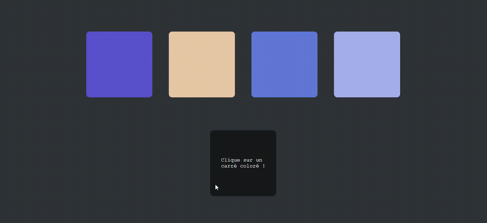

# JavaScript : Exercice II 💻 #
## - Créer une page web avec 4 carrés de différentes couleurs - ##

 

### Objectifs : ###
***Créer une page web affichant 4 carrés de 200 x 200 pixels avec un fond de couleur différente pour chaque carré.***

→ En cliquant sur n'importe quel carré du haut, le carré du bas : 
      <ul><ul>
        <li>prend sa couleur</li>
        <li>et le code couleur du carré sélectionné s’affiche.</li>
      </ul></ul>
 
### ⚙️ Langages utilisés ⚙️ ###

 

### Preview : ###
</img>

 

*Note : exercice fourni par <a href="https://elan-formation.fr/accueil">Elan Formation</a>*